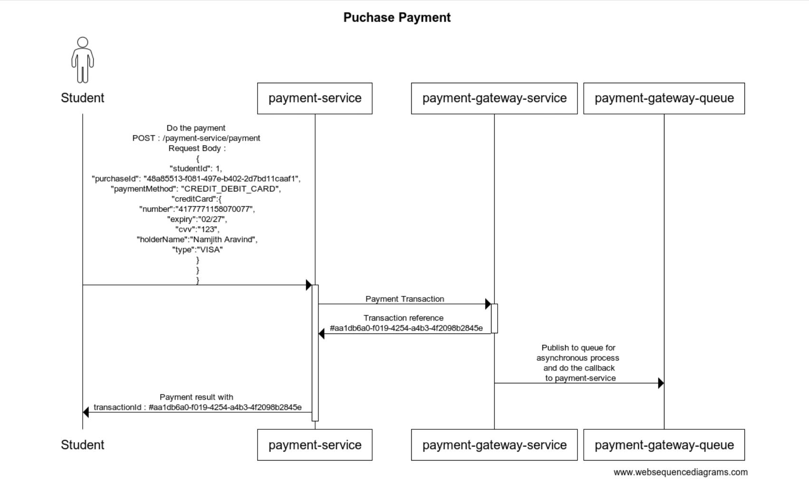
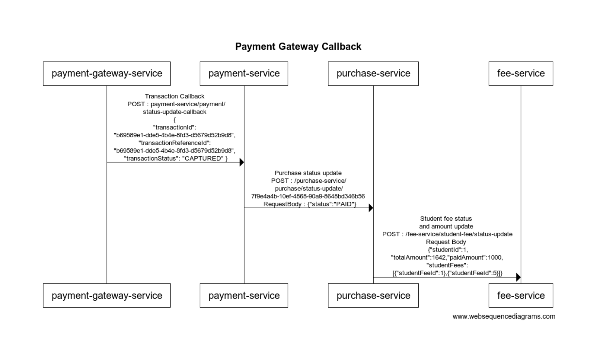
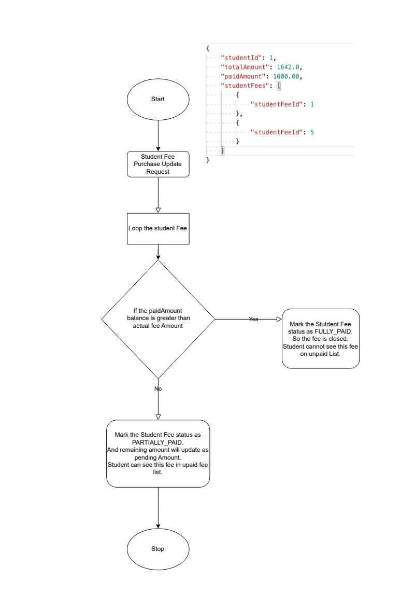

# Student Service
# Student Management System
### Student management system is a collection of microservice applications to full fill the school fee collection of multiple schools. All the microservice are easily scalable , fault tolerant and fault resilient. 
## Microservices
- Student Service : https://github.com/namjitharavind/student-service.git
- Fee Service : https://github.com/namjitharavind/fee-service.git
- Purchase Service : https://github.com/namjitharavind/purchase-service.git
- Payment Service : https://github.com/namjitharavind/payment-service.git
- Payment Gateway Service : https://github.com/namjitharavind/payment-gateway-service.git

### Design Patterns 
- Resilience Patterns
  - Timeout
  - Retry
  - Circuit Breaker
- Observability Patterns :
  - Tracing
  - Logging
  - Metrics
## Architecture


### 1. Create a Fee and Assign those fee to all students by grade.


### 2. Purchase Student fee
#### After the assigning of the fees to students, they will get started seeing their fees. And students can purchase multiple available fees.


### 3. Purchase Payment


### 4. Payment Gateway Callback to Payment service
####   Since this service is idempotent, even though if the payment service or its downstream application failed, We can call the payment service again manually or from another retry batch service which call exponentially. In this case even if the payment-service is not yet received any callback from payment-gateway-service, payment service will call the gateway service with the transactionId to get the transaction status. Based on this payment service can call its downstream application which purchase service here.



### 5. Purchase status api logic in Fee service




## Sample API Flow with proper request  and response.

### Note : Students and Fees are already added through data.sql. So we can start from Assign fee to students API.

<table>
<tr>
<td> Order </td>
<td> Name </td>
<td> URL </td>
<td> HTTP Method </td>
<td> Request </td>
<td> Status </td>
<td> Response </td>
</tr>
<tr>
<td> 1 </td>
<td> Get all students by Grade </td>
<td> http://localhost:9080/student-service/student/grade/UKG </td>
<td> GET </td>
<td>  </td>
<td> 200 </td>
<td>
<details close>
  <summary>Json</summary>

```json
[
  {
    "id": 1,
    "name": "Mahendra Singh Dhoni",
    "grade": "UKG",
    "mobile": "+971 509834777",
    "school": "Gems Legacy"
  },
  {
    "id": 2,
    "name": "Sourav Ganguly",
    "grade": "UKG",
    "mobile": "+971 509834888",
    "school": "Gems Legacy"
  },
  {
    "id": 3,
    "name": "Sachin Tendulkar",
    "grade": "UKG",
    "mobile": "+971 509834999",
    "school": "Gems Legacy"
  },
  {
    "id": 4,
    "name": "Sanju Samson",
    "grade": "UKG",
    "mobile": "+971 509834111",
    "school": "Gems Legacy"
  }
]
```
</details>
</td>
</tr>
<tr>
<td> 2 </td>
<td> Get a Student By Id </td>
<td> http://localhost:9080/student-service/student/1 </td>
<td> GET </td>
<td>  </td>
<td> 200 </td>
<td>
<details close>
  <summary>Json</summary>

```json
{
  "id": 1,
  "name": "Mahendra Singh Dhoni",
  "grade": "UKG",
  "mobile": "+971 509834777",
  "school": "Gems Legacy"
}
```
</details>
</td>
</tr>
<tr>
<td> 3 </td>
<td> Get all Fees </td>
<td>http://localhost:9081/fee-service/fee</td>
<td> GET </td>
<td>  </td>
<td> 200 </td>
<td>
<details close>
  <summary>Json</summary>

```json
[
  {
    "id": 1,
    "name": "APR 2024 TUTION FEE",
    "type": "TUTION",
    "currency": "AED",
    "amount": 833.0,
    "creationDate": "2024-04-01T00:00:00+04:00",
    "dueDate": "2024-04-20T00:00:00+04:00"
  },
  {
    "id": 2,
    "name": "MAY 2024 TUTION FEE",
    "type": "TUTION",
    "currency": "AED",
    "amount": 809.0,
    "creationDate": "2024-05-01T00:00:00+04:00",
    "dueDate": "2024-05-20T00:00:00+04:00"
  },
  {
    "id": 3,
    "name": "JUN 2024 TUTION FEE",
    "type": "TUTION",
    "currency": "AED",
    "amount": 833.0,
    "creationDate": "2024-06-01T00:00:00+04:00",
    "dueDate": "2024-06-20T00:00:00+04:00"
  },
  {
    "id": 4,
    "name": "AUG 2024 TUTION FEE",
    "type": "TUTION",
    "currency": "AED",
    "amount": 833.0,
    "creationDate": "2024-08-01T00:00:00+04:00",
    "dueDate": "2024-08-20T00:00:00+04:00"
  },
  {
    "id": 5,
    "name": "SEP 2024 TUTION FEE",
    "type": "TUTION",
    "currency": "AED",
    "amount": 833.0,
    "creationDate": "2024-09-01T00:00:00+04:00",
    "dueDate": "2024-09-20T00:00:00+04:00"
  },
  {
    "id": 6,
    "name": "OCT 2024 TUTION FEE",
    "type": "TUTION",
    "currency": "AED",
    "amount": 833.0,
    "creationDate": "2024-10-01T00:00:00+04:00",
    "dueDate": "2024-10-20T00:00:00+04:00"
  },
  {
    "id": 7,
    "name": "NOV 2024 TUTION FEE",
    "type": "TUTION",
    "currency": "AED",
    "amount": 833.0,
    "creationDate": "2024-11-01T00:00:00+04:00",
    "dueDate": "2024-11-20T00:00:00+04:00"
  },
  {
    "id": 8,
    "name": "DEC 2024 TUTION FEE",
    "type": "TUTION",
    "currency": "AED",
    "amount": 833.0,
    "creationDate": "2024-12-01T00:00:00+04:00",
    "dueDate": "2024-12-20T00:00:00+04:00"
  },
  {
    "id": 9,
    "name": "JAN 2024 TUTION FEE",
    "type": "TUTION",
    "currency": "AED",
    "amount": 833.0,
    "creationDate": "2024-01-01T00:00:00+04:00",
    "dueDate": "2024-01-20T00:00:00+04:00"
  },
  {
    "id": 10,
    "name": "FEB 2024 TUTION FEE",
    "type": "TUTION",
    "currency": "AED",
    "amount": 833.0,
    "creationDate": "2024-02-01T00:00:00+04:00",
    "dueDate": "2024-02-20T00:00:00+04:00"
  },
  {
    "id": 11,
    "name": "MAR 2024 TUTION FEE",
    "type": "TUTION",
    "currency": "AED",
    "amount": 833.0,
    "creationDate": "2024-03-01T00:00:00+04:00",
    "dueDate": "2024-03-20T00:00:00+04:00"
  }
]
```
</details>
</td>
</tr>
<tr>
<td> 4 </td>
<td> Get a Fee By Id </td>
<td>http://localhost:9081/fee-service/fee/1</td>
<td> GET </td>
<td>  </td>
<td> 200 </td>
<td>
<details close>
  <summary>Json</summary>

```json
{
  "id": 1,
  "name": "APR 2024 TUTION FEE",
  "type": "TUTION",
  "currency": "AED",
  "amount": 833.0,
  "creationDate": "2024-04-01T00:00:00+04:00",
  "dueDate": "2024-04-20T00:00:00+04:00"
}
```
</details>
</td>
</tr>
<tr>
<td> 5 </td>
<td> Assign Fee to all student by Grade </td>
<td>http://localhost:9081/fee-service/student-fee/assign-by-grade/UKG</td>
<td> POST </td>
<td>
<details close>
  <summary>Json</summary>

```json
{
    "feeId": 2
}
```
</details>
</td>
<td> 200 </td>
<td>
<details close>
  <summary>Json</summary>

```json
[
  {
    "id": 5,
    "studentId": 1,
    "feeId": 2,
    "status": "PENDING",
    "amount": null,
    "paidAmount": null,
    "paidDate": null,
    "creationDate": "2024-05-06T15:45:39.16534+04:00",
    "name": null,
    "type": null,
    "currency": null,
    "dueDate": null
  },
  {
    "id": 6,
    "studentId": 2,
    "feeId": 2,
    "status": "PENDING",
    "amount": null,
    "paidAmount": null,
    "paidDate": null,
    "creationDate": "2024-05-06T15:45:39.16618+04:00",
    "name": null,
    "type": null,
    "currency": null,
    "dueDate": null
  },
  {
    "id": 7,
    "studentId": 3,
    "feeId": 2,
    "status": "PENDING",
    "amount": null,
    "paidAmount": null,
    "paidDate": null,
    "creationDate": "2024-05-06T15:45:39.166909+04:00",
    "name": null,
    "type": null,
    "currency": null,
    "dueDate": null
  },
  {
    "id": 8,
    "studentId": 4,
    "feeId": 2,
    "status": "PENDING",
    "amount": null,
    "paidAmount": null,
    "paidDate": null,
    "creationDate": "2024-05-06T15:45:39.167525+04:00",
    "name": null,
    "type": null,
    "currency": null,
    "dueDate": null
  }
]
```

</details>
</td>
</tr>
<tr>
<td> 6 </td>
<td> Get Students Unpaid Fee </td>
<td>http://localhost:9081/fee-service/student-fee?studentId=1&isPaid=false</td>
<td> GET </td>
<td>  </td>
<td> 200 </td>
<td>
<details close>
  <summary>Json</summary>

```json
[
  {
    "id": 1,
    "studentId": 1,
    "feeId": 2,
    "status": "PENDING",
    "amount": 809.0,
    "paidAmount": null,
    "paidDate": null,
    "creationDate": "2024-05-07T16:26:57.560439+04:00",
    "name": "MAY 2024 TUTION FEE",
    "type": "TUTION",
    "currency": "AED",
    "dueDate": "2024-05-20T00:00:00+04:00"
  },
  {
    "id": 5,
    "studentId": 1,
    "feeId": 1,
    "status": "PENDING",
    "amount": 833.0,
    "paidAmount": null,
    "paidDate": null,
    "creationDate": "2024-05-07T16:27:04.531788+04:00",
    "name": "APR 2024 TUTION FEE",
    "type": "TUTION",
    "currency": "AED",
    "dueDate": "2024-04-20T00:00:00+04:00"
  }
]
```

</details>
</td>
</tr>
<tr>
<td> 7 </td>
<td> Get Students Fee By Id </td>
<td>http://localhost:9081/fee-service/student-fee/1</td>
<td> GET </td>
<td>  </td>
<td> 200 </td>
<td>
<details close>
  <summary>Json</summary>

```json
{
  "id": 1,
  "studentId": 1,
  "feeId": 1,
  "status": "PENDING",
  "amount": 833.0,
  "paidAmount": null,
  "paidDate": null,
  "creationDate": "2024-05-06T15:45:35.031547+04:00",
  "name": "APR 2024 TUTION FEE",
  "type": "TUTION",
  "currency": "AED",
  "dueDate": "2024-04-20T00:00:00+04:00"
}
```

</details>
</td>
</tr>

<tr>
<td> 8 </td>
<td> Create Purchase </td>
<td>http://localhost:9082/purchase-service/purchase</td>
<td> POST </td>
<td> 
<details close>
  <summary>Json</summary>

```json
{
  "id": "48a85513-f081-497e-b402-2d7bd11caaf1",
  "studentId": 1,
  "studentName": "Mahendra Singh Dhoni",
  "schoolName": "Gems Legacy",
  "totalAmount": 1642.0,
  "customAmount": 1642.0,
  "currency": "AED",
  "creationDate": "2024-05-06T15:46:04.299712+04:00",
  "paidDate": null,
  "status": "CREATED",
  "purchaseFees": [
    {
      "id": 1,
      "feeId": 1,
      "feeName": "APR 2024 TUTION FEE",
      "feeAmount": 833.0,
      "feeCurrency": "AED"
    },
    {
      "id": 2,
      "feeId": 5,
      "feeName": "MAY 2024 TUTION FEE",
      "feeAmount": 809.0,
      "feeCurrency": "AED"
    }
  ]
}
```

</details>
</td>
<td> 200 </td>
<td>
<details close>
  <summary>Json</summary>

```json
{
  "id": 1,
  "studentId": 1,
  "feeId": 1,
  "status": "PENDING",
  "amount": 833.0,
  "paidAmount": null,
  "paidDate": null,
  "creationDate": "2024-05-06T15:45:35.031547+04:00",
  "name": "APR 2024 TUTION FEE",
  "type": "TUTION",
  "currency": "AED",
  "dueDate": "2024-04-20T00:00:00+04:00"
}
```

</details>
</td>
</tr>

<tr>
<td> 9 </td>
<td> Purchase </td>
<td>http://localhost:9082/purchase-service/purchase</td>
<td> POST </td>
<td> 
<details close>
  <summary>Json</summary>

```json
{
  "id": "48a85513-f081-497e-b402-2d7bd11caaf1",
  "studentId": 1,
  "studentName": "Mahendra Singh Dhoni",
  "schoolName": "Gems Legacy",
  "totalAmount": 1642.0,
  "customAmount": 1642.0,
  "currency": "AED",
  "creationDate": "2024-05-06T15:46:04.299712+04:00",
  "paidDate": null,
  "status": "CREATED",
  "purchaseFees": [
    {
      "id": 1,
      "feeId": 1,
      "feeName": "APR 2024 TUTION FEE",
      "feeAmount": 833.0,
      "feeCurrency": "AED"
    },
    {
      "id": 2,
      "feeId": 5,
      "feeName": "MAY 2024 TUTION FEE",
      "feeAmount": 809.0,
      "feeCurrency": "AED"
    }
  ]
}
```

</details>
</td>
<td> 200 </td>
<td>
<details close>
  <summary>Json</summary>

```json
{
  "id": "02179a18-88cb-48fd-a845-ef505a68a57b",
  "studentId": 1,
  "studentName": "Mahendra Singh Dhoni",
  "schoolName": "Gems Legacy",
  "totalAmount": 1642.0,
  "customAmount": 1642.0,
  "currency": "AED",
  "creationDate": "2024-05-07T16:45:47.962866+04:00",
  "paidDate": null,
  "status": "CREATED",
  "purchaseFees": [
    {
      "id": 1,
      "feeId": 1,
      "feeName": "MAY 2024 TUTION FEE",
      "feeAmount": 809.0,
      "feeCurrency": "AED"
    },
    {
      "id": 2,
      "feeId": 5,
      "feeName": "APR 2024 TUTION FEE",
      "feeAmount": 833.0,
      "feeCurrency": "AED"
    }
  ]
}
```

</details>
</td>
</tr>

<tr>
<td> 10 </td>
<td> Purchase Custom Amount Update </td>
<td>http://localhost:9082/purchase-service/purchase/custom-amount-update/48a85513-f081-497e-b402-2d7bd11caaf1</td>
<td> POST </td>
<td> 
<details close>
  <summary>Json</summary>

```json
{
  "customAmount": 1000
}
```

</details>
</td>
<td> 200 </td>
<td>
<details close>
  <summary>Json</summary>

```json
{
  "id": "02179a18-88cb-48fd-a845-ef505a68a57b",
  "studentId": 1,
  "studentName": "Mahendra Singh Dhoni",
  "schoolName": "Gems Legacy",
  "totalAmount": 1642.0,
  "customAmount": 1000.0,
  "currency": "AED",
  "creationDate": "2024-05-07T16:45:47.962866+04:00",
  "paidDate": null,
  "status": "CREATED",
  "purchaseFees": [
    {
      "id": 1,
      "feeId": 1,
      "feeName": "MAY 2024 TUTION FEE",
      "feeAmount": 809.0,
      "feeCurrency": "AED"
    },
    {
      "id": 2,
      "feeId": 5,
      "feeName": "APR 2024 TUTION FEE",
      "feeAmount": 833.0,
      "feeCurrency": "AED"
    }
  ]
}
```

</details>
</td>
</tr>

<tr>
<td> 11 </td>
<td> Get Purchase By Id </td>
<td>http://localhost:9082/purchase-service/purchase/02179a18-88cb-48fd-a845-ef505a68a57b</td>
<td> GET </td>
<td> 

</td>
<td> 200 </td>
<td>
<details close>
  <summary>Json</summary>

```json
{
  "id": "02179a18-88cb-48fd-a845-ef505a68a57b",
  "studentId": 1,
  "studentName": "Mahendra Singh Dhoni",
  "schoolName": "Gems Legacy",
  "totalAmount": 1642.0,
  "customAmount": 1000.0,
  "currency": "AED",
  "creationDate": "2024-05-07T16:45:47.962866+04:00",
  "paidDate": null,
  "status": "CREATED",
  "purchaseFees": [
    {
      "id": 1,
      "feeId": 1,
      "feeName": "MAY 2024 TUTION FEE",
      "feeAmount": 809.0,
      "feeCurrency": "AED"
    },
    {
      "id": 2,
      "feeId": 5,
      "feeName": "APR 2024 TUTION FEE",
      "feeAmount": 833.0,
      "feeCurrency": "AED"
    }
  ]
}
```

</details>
</td>
</tr>

<tr>
<td> 12 </td>
<td> Get all Purchase By StudentId </td>
<td>http://localhost:9082/purchase-service/purchase/student/1</td>
<td> GET </td>
<td> 

</td>
<td> 200 </td>
<td>
<details close>
  <summary>Json</summary>

```json
[
  {
    "id": "02179a18-88cb-48fd-a845-ef505a68a57b",
    "studentId": 1,
    "studentName": "Mahendra Singh Dhoni",
    "schoolName": "Gems Legacy",
    "totalAmount": 1642.0,
    "customAmount": 1000.0,
    "currency": "AED",
    "creationDate": "2024-05-07T16:45:47.962866+04:00",
    "paidDate": null,
    "status": "CREATED",
    "purchaseFees": [
      {
        "id": 1,
        "feeId": 1,
        "feeName": "MAY 2024 TUTION FEE",
        "feeAmount": 809.0,
        "feeCurrency": "AED"
      },
      {
        "id": 2,
        "feeId": 5,
        "feeName": "APR 2024 TUTION FEE",
        "feeAmount": 833.0,
        "feeCurrency": "AED"
      }
    ]
  }
]
```

</details>
</td>
</tr>
<tr>
<td> 13 </td>
<td> Process Payment </td>
<td>http://localhost:9083/payment-service/payment</td>
<td> POST </td>
<td> 
<details close>
  <summary>Json</summary>

```json
{
  "studentId": 1,
  "purchaseId": "02179a18-88cb-48fd-a845-ef505a68a57b",
  "paymentMethod": "CREDIT_DEBIT_CARD",
  "creditCard":{
    "number":"4177771158070077",
    "expiry":"02/27",
    "cvv":"123",
    "holderName":"Namjith Aravind",
    "type":"VISA"
  }
}
```

</details>
</td>
<td> 200 </td>
<td>
<details close>
  <summary>Json</summary>

```json
{
  "id": "d38e4fcc-c911-4a6e-bcec-37d0b620d92d",
  "studentId": "1",
  "purchaseId": "02179a18-88cb-48fd-a845-ef505a68a57b",
  "transactionReference": "1dae7e34-8f0d-4a3c-93f7-483a199d5e8c",
  "status": "NOT_YET_STARTED",
  "amount": 1000.0,
  "currency": "AED",
  "paymentMethod": "CREDIT_DEBIT_CARD",
  "transactionDate": "2024-05-07T17:02:47.226433+04:00",
  "creditCard": {
    "number": "4177771158070077",
    "expiry": "02/27",
    "cvv": "123",
    "holderName": "Namjith Aravind",
    "type": "VISA"
  }
}
```

</details>
</td>
</tr>
</table>


