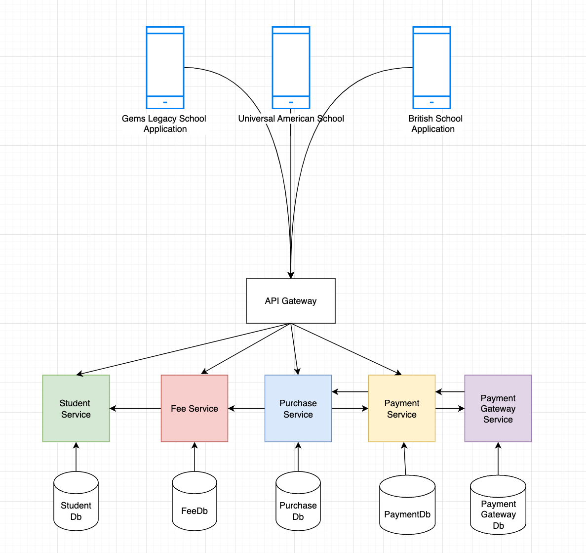
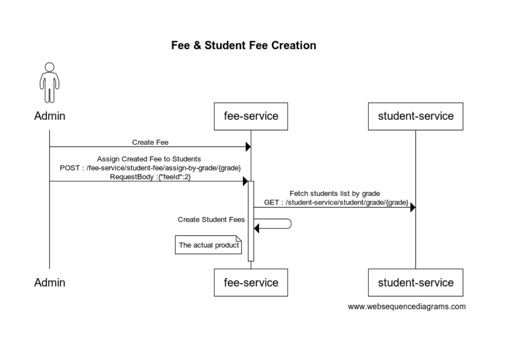
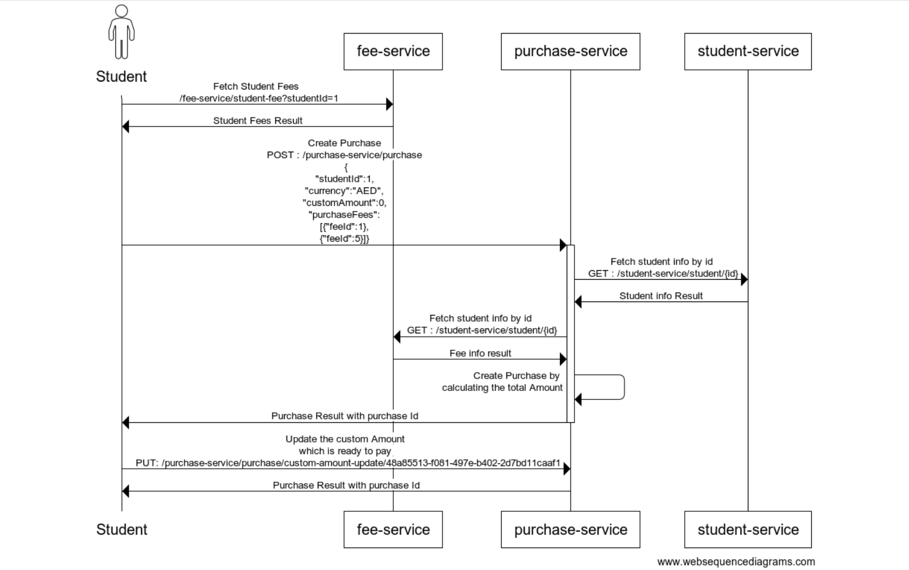

# Student Service

### Student are the main customer of a student management system.

### 1. Create a Fee and Assign those fee to all students by grade.

### 2. Purchase Student fee
#### After the assigning of the fees to students, they will get started seeing their fees. And students can purchase multiple available fees.
